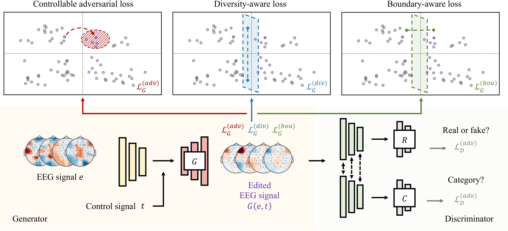

# ESC-GAN - Official PyTorch Implementation

#### [Project Page](https://github.com/tczhangzhi/PyTorch-ESCGAN) | [Paper]() | [Poster](assets/poster.pdf) | [Q&A](https://app.gitter.im/#/room/!qsZoWNuxEXLNtnwSoI:gitter.im)

This is the official implementation of the paper "Beyond Mimicking Under-Represented Emotions: Deep Data Augmentation with Emotional Subspace Constraints for EEG-Based Emotion Recognition". 

[Zhi Zhang](https://github.com/tczhangzhi)<sup>1,2</sup>, [Sheng-hua Zhong](https://sheng-hua-zhong.weebly.com/)<sup>1,*</sup>, [Yan Liu](https://www4.comp.polyu.edu.hk/~csyliu/)<sup>2</sup>

<sup>1</sup>Shen Zhen University, <sup>2</sup>The Hong Kong Polytechnic University.

<div align="center">
    
</div>

## Abstract

In recent years, using Electroencephalography (EEG) to recognize emotions has garnered considerable attention. Despite advancements, limited EEG data restricts its potential. Thus, Generative Adversarial Networks (GANs) are proposed to mimic the observed distributions and generate EEG data. However, for imbalanced datasets, GANs struggle to produce reliable augmentations for under-represented minority emotions by merely mimicking them. Thus, we introduce Emotional Subspace Constrained Generative Adversarial Networks (ESC-GAN) as an alternative to existing frameworks. We first propose the EEG editing paradigm, editing reference EEG signals from well-represented to under-represented emotional subspaces. Then, we introduce diversity-aware and boundary-aware losses to constrain the augmented subspace. Here, the diversity-aware loss encourages a diverse emotional subspace by enlarging the sample difference, while boundary-aware loss constrains the augmented subspace near the decision boundary where recognition models can be vulnerable. Experiments show ESC-GAN boosts emotion recognition performance on benchmark datasets, DEAP, AMIGOS, and SEED, while protecting against potential adversarial attacks. Finally, the proposed method opens new avenues for editing EEG signals under emotional subspace constraints, facilitating unbiased and secure EEG data augmentation.

## Roadmap

In order to help readers reproduce the experimental results of this paper easily, we will open-source our study following this roadmap:

- [ ] Organize and open-source research codes (by March 15)
- [ ] Provide a quick start guide to help users get started with the project quickly (by March 22)
- [ ] Refactor our research codes into plug-and-play features suitable for different data augmentation scenarios (by April 5)

## Environment

The code is developed and tested on the following environment:

* Python 3.8.18
* PyTorch 1.12.1
* CUDA 11.3

## Dataset

* DEAP<sup>[1]</sup> dataset: https://www.eecs.qmul.ac.uk/mmv/datasets/deap/download.html
* AMIGOS<sup>[2]</sup> dataset: http://www.eecs.qmul.ac.uk/mmv/datasets/amigos/download.html
* SEED<sup>[3]</sup> dataset: https://bcmi.sjtu.edu.cn/home/seed/index.html

[1] Koelstra S, Muhl C, Soleymani M, et al. DEAP: A database for emotion analysis; using physiological signals[J]. IEEE transactions on affective computing, 2011, 3(1): 18-31.

[2] Miranda-Correa J A, Abadi M K, Sebe N, et al. Amigos: A dataset for affect, personality and mood research on individuals and groups[J]. IEEE Transactions on Affective Computing, 2018, 12(2): 479-493.

[3] Zheng W L, Lu B L. Investigating critical frequency bands and channels for EEG-based emotion recognition with deep neural networks[J]. IEEE Transactions on Autonomous Mental Development, 2015, 7(3): 162-175.

## Contact

If you have any questions, please feel free to open an issue. During the AAAI Conference (FEBRUARY 20-27, 2024 | VANCOUVER, CANADA), we support Gitter for online question answering.

## Citation

If you find this code useful for your research, please cite:

```latex
@inproceedings{zhang2024beyond,
    title={Beyond Mimicking Under-Represented Emotions: Deep Data Augmentation with Emotional Subspace Constraints for {EEG}-Based Emotion Recognition},
    author={Zhi Zhang and Shenghua Zhong and Yan Liu},
    year={2024},
    booktitle={AAAI 2024}
}
```